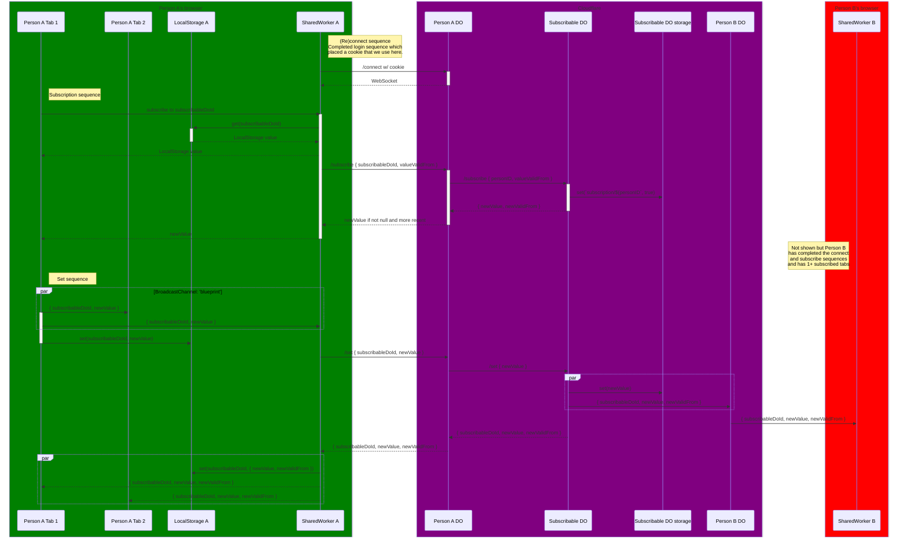

```mermaid
sequenceDiagram

  box green Person A's browser
    participant Person A Tab 1
    participant Person A Tab 2
    participant LocalStorage A
    participant SharedWorker A
  end

  box purple Cloudflare
    participant Person A DO
    participant Subscribable DO
    participant Subscribable DO storage
    participant Person B DO
  end

  box red Person B's browser
    participant SharedWorker B
  end

  Note right of SharedWorker A: (Re)connect sequence <br> Completed login sequence which <br> placed a cookie that we use here.

    SharedWorker A ->> + Person A DO: /connect w/ cookie
    Person A DO -->> - SharedWorker A: WebSocket

  Note right of Person A Tab 1: Subscription sequence

    Person A Tab 1 ->> SharedWorker A: subscribe to subscribableDoId
    activate SharedWorker A
      SharedWorker A ->> + LocalStorage A: get(subscribableDoId)
        LocalStorage A -->> - SharedWorker A: LocalStorage value
      SharedWorker A -->> Person A Tab 1: LocalStorage value
      SharedWorker A ->> + Person A DO: /subscribe { subscribableDoId, valueValidFrom }

        Person A DO ->> + Subscribable DO: /subscribe { personID, valueValidFrom }
          Subscribable DO ->> Subscribable DO storage: set(`subscription/${personID`, true)
          Subscribable DO -->> - Person A DO: { newValue, newValidFrom }
        Person A DO -->> - SharedWorker A: newValue if not null and more recent
      SharedWorker A -->> Person A Tab 1: newValue
    deactivate SharedWorker A

  Note left of SharedWorker B: Not shown but Person B <br> has completed the connect <br> and subscribe sequences <br> and has 1+ subscribed tabs

  Note right of Person A Tab 1: Set sequence

    par BroadcastChannel: 'blueprint'
      Person A Tab 1 ->> Person A Tab 2: { subscribableDoId, newValue }
      activate Person A Tab 1
      Person A Tab 1 ->> SharedWorker A: { subscribableDoId, newValue }
    end
    Person A Tab 1 ->> LocalStorage A: set(subscribableDoId, newValue)
    deactivate Person A Tab 1
    SharedWorker A ->> Person A DO: /set { subscribableDoId, newValue }
    Person A DO ->> Subscribable DO: /set { newValue }
          par
          Subscribable DO ->> Subscribable DO storage: set(newValue)
          Subscribable DO ->> Person B DO: { subscribableDoId, newValue, newValidFrom }
          end
            Person B DO ->> SharedWorker B: { subscribableDoId, newValue, newValidFrom }
          Subscribable DO -->> Person A DO: { subscribableDoId, newValue, newValidFrom }
        Person A DO -->> SharedWorker A: { subscribableDoId, newValue, newValidFrom }
        par
        SharedWorker A ->> LocalStorage A: set(subscribableDoId, { newValue, newValidFrom })
      SharedWorker A -->> Person A Tab 1: { subscribableDoId, newValue, newValidFrom }
      SharedWorker A -->> Person A Tab 2: { subscribableDoId, newValue, newValidFrom }
      end


```
