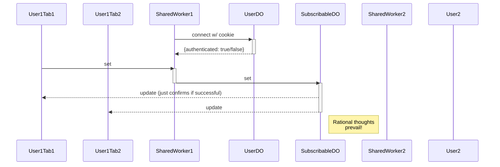

```mermaid
sequenceDiagram

participant User1Tab1
participant User1Tab2
participant SharedWorker1
participant UserDO
participant SubscribableDO
participant SharedWorker2
participant User2

SharedWorker1->>+UserDO: connect w/ cookie
UserDO-->>-SharedWorker1: {authenticated: true/false}

User1Tab1->>SharedWorker1: set
activate SharedWorker1
SharedWorker1->>SubscribableDO: set
deactivate SharedWorker1
activate SubscribableDO
SubscribableDO-->>User1Tab1: update (just confirms if successful)
SubscribableDO-->>User1Tab2: update
deactivate SubscribableDO

Note right of SubscribableDO: Rational thoughts <br/>prevail!


```
